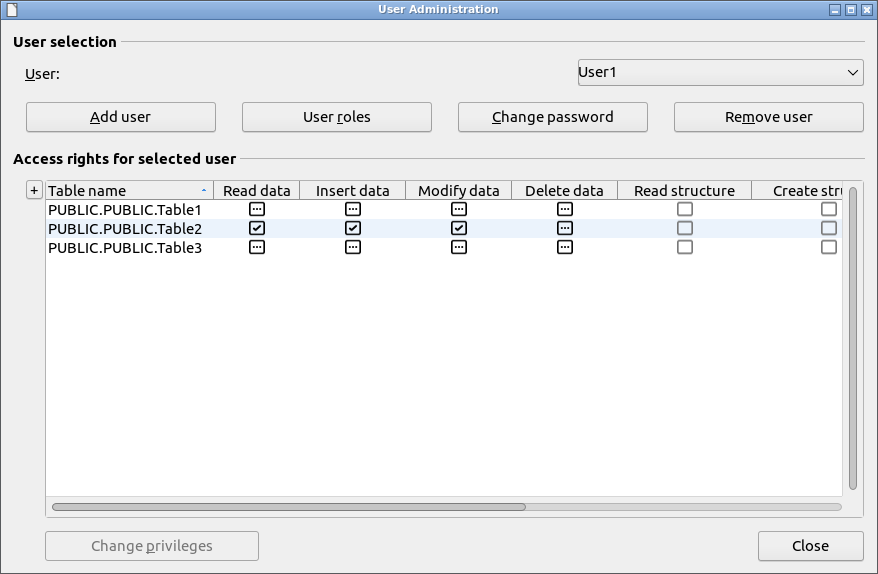
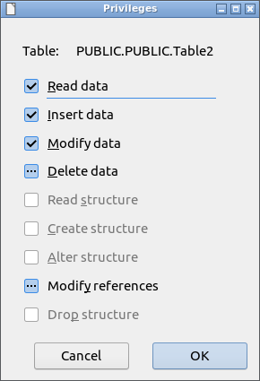
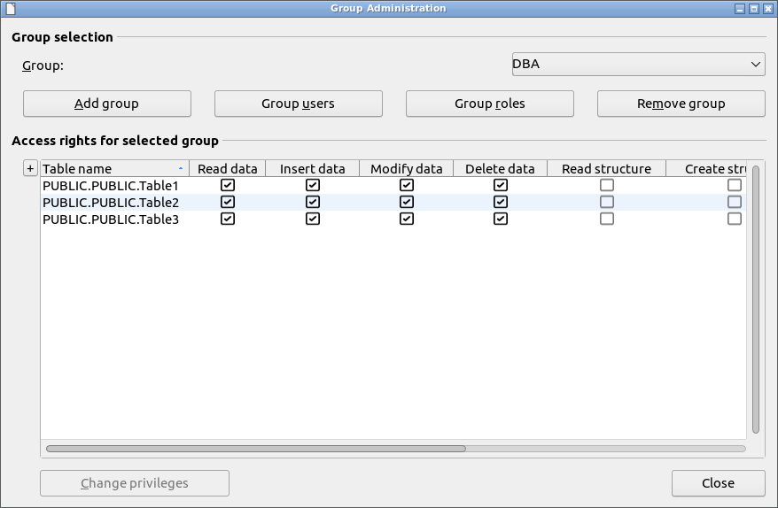

#  jdbcDriverOOo

**Ce [document](https://prrvchr.github.io/jdbcDriverOOo/README_fr) en français.**

**The use of this software subjects you to our** [**Terms Of Use**](https://prrvchr.github.io/jdbcDriverOOo/source/jdbcDriverOOo/registration/TermsOfUse_en)

# version [0.0.4](https://prrvchr.github.io/jdbcDriverOOo/#what-has-been-done-for-version-004)

## Introduction:

**jdbcDriverOOo** is part of a [Suite](https://prrvchr.github.io/) of [LibreOffice](https://www.libreoffice.org/download/download/) and/or [OpenOffice](https://www.openoffice.org/download/index.html) extensions allowing to offer you innovative services in these office suites.  

This extension allows you to use the JDBC driver of your choice directly in Base.  
It embeds the drivers for the following databases:
- [HyperSQL or HsqlDB](http://hsqldb.org/) version 2.61.
    The supported HsqlDB managed protocols are: hsql://, hsqls://, http://, https://, mem://, file:// and res://.
- [H2 Database Engine](https://www.h2database.com/html/main.html) version 2.1.212.
- [Apache Derby](https://db.apache.org/derby/) version 10.15.2.0.

Being free software I encourage you:
- To duplicate its [source code](https://github.com/prrvchr/jdbcDriverOOo/).
- To make changes, corrections, improvements.
- To open [issue](https://github.com/prrvchr/jdbcDriverOOo/issues/new) if needed.

In short, to participate in the development of this extension.  
Because it is together that we can make Free Software smarter.

## Requirement:

jdbcDriverOOo is a JDBC driver written in Java.  
Its use requires the [installation and configuration](https://wiki.documentfoundation.org/Documentation/HowTo/Install_the_correct_JRE_-_LibreOffice_on_Windows_10) in LibreOffice / OpenOffice of a **JRE version 11 or later**.  
I recommend [Adoptium](https://adoptium.net/releases.html?variant=openjdk11) as your Java installation source.

If you are using the HsqlDB driver with **LibreOffice on Linux**, then you are subject to [bug 139538](https://bugs.documentfoundation.org/show_bug.cgi?id=139538).  
To work around the problem, please uninstall the packages:
- libreoffice-sdbc-hsqldb
- libhsqldb1.8.0-java

If you still want to use the Embedded HsqlDB functionality provided by LibreOffice, then install the [HsqlDBembeddedOOo](https://prrvchr.github.io/HsqlDBembeddedOOo/) extension.  
OpenOffice and LibreOffice on Windows are not subject to this malfunction.

## Installation:

It seems important that the file was not renamed when it was downloaded.
If necessary, rename it before installing it.

- Install  **[jdbcDriverOOo.oxt](https://github.com/prrvchr/jdbcDriverOOo/raw/master/source/jdbcDriverOOo/dist/jdbcDriverOOo.oxt)** extension version 0.0.4.

Restart LibreOffice / OpenOffice after installation.

## Use:

This mode of use uses an HsqlDB database.

### How to create a new database:

In LibreOffice / OpenOffice go to File -> New -> Database...:

In step: Select database:
- select: Connect to an existing database
- choose: HsqlDB Driver
- click on button: Next

In step: Connection settings:

- for the protocol: **file://**
    - in Datasource URL put:
        - for **Linux**: `file:///tmp/testdb;default_schema=true;shutdown=true;hsqldb.default_table_type=cached;get_column_name=false`
        - for **Windows**: `file:///c:/tmp/testdb;default_schema=true;shutdown=true;hsqldb.default_table_type=cached;get_column_name=false`

- for the protocol: **hsql://**
    - In a terminal, go to a folder containing the hsqldb.jar archive and run:
        - for **Linux**: `java -cp hsqldb.jar org.hsqldb.server.Server --database.0 file:///tmp/testdb --silent false`
        - for **Windows**: `java -cp hsqldb.jar org.hsqldb.server.Server --database.0 file:///c:/tmp/testdb --silent false`
    - in Datasource URL put: `hsql://localhost/;default_schema=true`

- click on button: Next

In step: Set up user authentication:
- click on button: Test connection

If the connection was successful, you should see this dialog window:

Have fun...

### How to update the JDBC driver:

It is possible to update the JDBC driver (hsqldb.jar, h2.jar, derbytools.jar) to a newer version.  
If you use HsqlDB as database, follow these steps:
1. Make a copy (backup) of the folder containing your database.
2. Start LibreOffice / OpenOffice and change the version of the HsqlDB driver in: **Tools -> Options -> Base drivers -> JDBC Driver**, by a more recent version.
3. Restart LibreOffice / OpenOffice after changing the driver (hsqldb.jar).
4. In Base, after opening your database, go to: **Tools -> SQL** and type the SQL command: `SHUTDOWN COMPACT` or `SHUTDOWN SCRIPT`.

Now your database is up to date.

## LibreOffice/OpenOffice Base improvement:

This driver allows in LibreOffice / OpenOffice Base the management of **users**, **roles** (groups) and their associated **privileges** of the underlying database.

### Managing Users and Privileges in Base:

User management of the underlying database is accessible in Base via the menu: **Administration -> User administration**

The privileges management of the users of the underlying database is accessible in this window by the button: **Change privileges**

### Managing roles (groups) in Base:

The management of the roles (groups) of the underlying database is accessible in Base via the menu: **Administration -> Group administration**

The management of users who are members of the group of the underlying database is accessible in this window via the button: **Group users**

## Has been tested with:

* LibreOffice 7.0.4.2 - Ubuntu 20.04 - LxQt 0.14.1

* LibreOffice 6.4.4.2 - Windows 7 SP1

I encourage you in case of problem :-(  
to create an [issue](https://github.com/prrvchr/jdbcDriverOOo/issues/new)  
I will try to solve it ;-)

## Historical:

### Introduction:

This driver was written to work around certain problems inherent in the UNO implementation of the JDBC driver built into LibreOffice / OpenOffice, namely: 

- The inability to provide the path to the Java driver archive (hsqldb.jar) when loading the JDBC driver.
- Not being able to use prepared SQL statements (PreparedStatement) see [bug 132195](https://bugs.documentfoundation.org/show_bug.cgi?id=132195).

In order to take advantage of the latest features offered by databases and among others HsqlDB, it was necessary to write a new driver.

Until version 0.0.3, this new driver is just a wrapper in Python around the UNO services provided by the defective LibreOffice / OpenOffice JDBC driver.  
Since version 0.0.4, it has been completely rewritten in Java under Eclipse, because who better than Java can provide access to JDBC in the UNO API...  
In order not to prevent the native JDBC driver from working, it loads when calling the following protocols:

- `xdbc:*`
- `xdbc:h2:*`
- `xdbc:derby:*`
- `xdbc:hsqldb:*`

but uses the `jdbc:*` protocol internally to connect.

It also provides functionality that the JDBC driver implemented in LibreOffice / OpenOffice does not provide, namely:

- The management of rights and users in Base.
- The use of the SQL Array type in the queries.
- Everything we are ready to implement.

For now, only the use of the SQL Array type in the queries is available.

### What has been done for version 0.0.1:

- The writing of this driver was facilitated by a [discussion with Villeroy](https://forum.openoffice.org/en/forum/viewtopic.php?f=13&t=103912), on the OpenOffice forum, which I would like to thank, because knowledge is only worth if it is shared...

- Using the new version of HsqlDB 2.5.1.

- Many other fix...

### What has been done for version 0.0.2:

- Added a dialog box allowing to update the driver (hsqldb.jar) in: Tools -> Options -> Base drivers -> HsqlDB driver

- Many other fix...

### What has been done for version 0.0.3:

- I especially want to thank fredt at [hsqldb.org](http://hsqldb.org/) for:

    - His welcome for this project and his permission to use the HsqlDB logo in the extension.

    - Its involvement in the test phase which made it possible to produce this version 0.0.3.

    - The quality of its HsqlDB database.

- Now works with OpenOffice on Windows.

- An unsupported protocol now displays an accurate error.

- A non-parsable url now displays a precise error.

- Now correctly handles spaces in filenames and paths.

- Many other fix...

### What has been done for version 0.0.4:

- Rewrite of [Driver](https://github.com/prrvchr/jdbcDriverOOo/blob/master/source/jdbcDriverOOo/source/io/github/prrvchr/uno/sdbc/Driver.java) in Java version 11 OpenJDK amd64 under Eclipse IDE for Java Developers version 4.23.0 with the plugins:
    - LOEclipse or LibreOffice Eclipse plugin for extension development version 4.0.1.
    - PyDev or Python IDE for Eclipse version 9.3.0.

- Writing the `Statement`, `PreparedStatement`, `CallableStatement`, `ResultSet`, `...` services of JDBC (thanks to hanya for [MRI](https://github.com/hanya/MRI) which was of great help to me...)

    - [com.sun.star.sdb.*](https://github.com/prrvchr/jdbcDriverOOo/tree/master/source/jdbcDriverOOo/source/io/github/prrvchr/uno/sdb)
    - [com.sun.star.sdbc.*](https://github.com/prrvchr/jdbcDriverOOo/tree/master/source/jdbcDriverOOo/source/io/github/prrvchr/uno/sdbc)
    - [com.sun.star.sdbcx.*](https://github.com/prrvchr/jdbcDriverOOo/tree/master/source/jdbcDriverOOo/source/io/github/prrvchr/uno/sdbcx)

- Integration in jdbcDriverOOo of **H2** and **Derby** JDBC drivers in addition to **HsqlDB**. Implementation of Java Services:

    - [Driver-HsqlDB.jar](https://github.com/prrvchr/jdbcDriverOOo/tree/master/source/Driver-HsqlDB/source/io/github/prrvchr/jdbcdriver/hsqldb)
    - [Driver-H2.jar](https://github.com/prrvchr/jdbcDriverOOo/tree/master/source/Driver-H2/source/io/github/prrvchr/jdbcdriver/h2)
    - [Driver-Derby.jar](https://github.com/prrvchr/jdbcDriverOOo/tree/master/source/Driver-Derby/source/io/github/prrvchr/jdbcdriver/derby)

    In order to correct possible defects, or incompatibility with the UNO API, of embedded JDBC drivers.

- Renamed the **HsqlDBDriverOOo** repository and extension to **jdbcDriverOOo**.

- Support in Base for auto-incrementing primary keys for HsqlDB and Derby. H2 does not support yet.

- Write of [com.sun.star.sdbcx.Driver](https://github.com/prrvchr/jdbcDriverOOo/blob/master/source/jdbcDriverOOo/source/io/github/prrvchr/uno/sdbcx/Driver.java). This high-level driver must allow the management of users and rights in Base. Its use can be requested in **Tools -> Options -> Base drivers -> JDBC Driver**. It is not finished and is not yet functional.

- Implemented a Java service provider [UnoLogger.jar](https://github.com/prrvchr/jdbcDriverOOo/tree/master/source/UnoLogger/source/io/github/prrvchr/uno/logging) for the [SLF4J](https://www.slf4j.org/) API to be able to redirect driver logging from the underlying databases to the UNO API [com.sun.star.logging.*](https://www.openoffice.org/api/docs/common/ref/com/sun/star/logging/module-ix.html).

- Rewrite, following the MVC model, of the [Options](https://github.com/prrvchr/jdbcDriverOOo/blob/master/source/jdbcDriverOOo/pythonpath/jdbcdriver/options) dialog accessible by: **Tools -> Options -> Base drivers -> JDBC Driver**, to allow:

    - Updating and/or adding Java archives of JDBC drivers.
    - Enabling driver logging of the underlying database.

- Many other fix...

### What remains to be done for version 0.0.4:

- Managing rights and users in Base in read and write mode.

- Add new languages for internationalization...

- Anything welcome...
