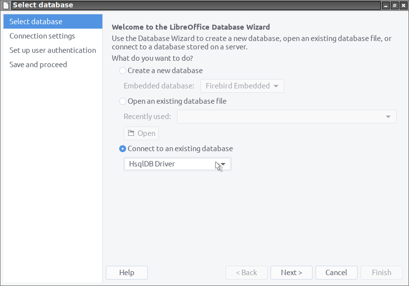

**This [document](https://prrvchr.github.io/HsqlDBDriverOOo/) in English.**

**L'utilisation de ce logiciel vous soumet à nos** [**Conditions d'utilisation**](https://prrvchr.github.io/HsqlDBDriverOOo/HsqlDBDriverOOo/registration/TermsOfUse_fr)

# version [0.0.3](https://prrvchr.github.io/HsqlDBDriverOOo/README_fr#historique)

## Introduction:

**HsqlDBDriverOOo** fait partie d'une [Suite](https://prrvchr.github.io/README_fr) d'extensions [LibreOffice](https://fr.libreoffice.org/download/telecharger-libreoffice/) et/ou [OpenOffice](https://www.openoffice.org/fr/Telecharger/) permettant de vous offrir des services inovants dans ces suites bureautique.  

Cette extension vous permet d'utiliser le pilote HsqlDB de votre choix, avec toutes ses fonctionnalités, directement dans Base.  
Elle prend en charge tous les protocoles gérés nativement par HsqlDB, à savoir: hsql://, hsqls://, http://, https://, mem://, file:// et res://.

Etant un logiciel libre je vous encourage:
- A dupliquer son [code source](https://github.com/prrvchr/HsqlDBDriverOOo/).
- A apporter des modifications, des corrections, des améliorations.
- D'ouvrir un [dysfonctionnement](https://github.com/prrvchr/HsqlDBDriverOOo/issues/new) si nécessaire.

Bref, à participer au developpement de cette extension.  
Car c'est ensemble que nous pouvons rendre le Logiciel Libre plus intelligent.

## Prérequis:

[HsqlDB](http://hsqldb.org/) est une base de données écrite en Java.  
L'utilisation de HsqlDB nécessite l'installation et la configuration dans LibreOffice / OpenOffice d'un **JRE version 1.8 minimum** (c'est-à-dire: Java version 8)  
Je vous recommande [AdoptOpenJDK](https://adoptopenjdk.net/) comme source d'installation de Java.

Si vous utilisez **LibreOffice sous Linux**, alors vous êtes sujet au [dysfonctionnement 139538](https://bugs.documentfoundation.org/show_bug.cgi?id=139538).  
Pour contourner le problème, veuillez désinstaller les paquets:
- libreoffice-sdbc-hsqldb
- libhsqldb1.8.0-java

Si vous souhaitez quand même utiliser la fonctionnalité HsqlDB intégré fournie par LibreOffice, alors installez l'extension [HsqlDBembeddedOOo](https://prrvchr.github.io/HsqlDBembeddedOOo/README_fr).  
OpenOffice et LibreOffice sous Windows ne sont pas soumis à ce dysfonctionnement.

## Installation:

Il semble important que le fichier n'ait pas été renommé lors de son téléchargement.  
Si nécessaire, renommez-le avant de l'installer.

- Installer l'extension [HsqlDBDriverOOo.oxt](https://github.com/prrvchr/HsqlDBDriverOOo/releases/download/v0.0.3/HsqlDBDriverOOo.oxt) version 0.0.3.

Redémarrez LibreOffice / OpenOffice après l'installation.

## Utilisation:

### Comment créer une nouvelle base de données:

Dans LibreOffice / OpenOffice aller à: Fichier -> Nouveau -> Base de données...:

A l'étape: Sélectionner une base de données:
- selectionner: Connecter une base de données existante
- choisir: Pilote HsqlDB
- cliquer sur le bouton: Suivant

A l'étape: Paramètres de connexion:

- pour le protocole: **file://**
    - dans URL de la source de données saisir:
        - pour Linux: file:///tmp/testdb;default_schema=true;shutdown=true;hsqldb.default_table_type=cached;get_column_name=false
        - pour Windows: file:///c:/tmp/testdb;default_schema=true;shutdown=true;hsqldb.default_table_type=cached;get_column_name=false

- pour le protocole: **hsql://**
    - Dans un terminal, se placer dans un dossier contenant l'archive hsqldb.jar et lancer:
        - pour Linux: java -cp hsqldb.jar org.hsqldb.server.Server --database.0 file:///tmp/testdb --silent false
        - pour windows: java -cp hsqldb.jar org.hsqldb.server.Server --database.0 file:///c:/tmp/testdb --silent false
    - dans URL de la source de données saisir: hsql://localhost/;default_schema=true

- cliquer sur le bouton: Suivant

A l'étape: Paramétrer l'authentification de l'utilisateur:
- cliquer sur le bouton: Tester la connexion

Si la connexion a réussi, vous devriez voir cette fenêtre de dialogue:

Maintenant à vous d'en profiter...

### Comment mettre à jour le pilote HsqlDB:

Si vous souhaitez mettre à jour le pilote HsqlDB (hsqldb.jar) vers une version plus récente, procédez comme suit:
- 1 - Faite une copie (sauvegarde) du dossier contenant votre base de données.
- 2 - Lancer LibreOffice / OpenOffice et changez la version du pilote HsqlDB dans: Outils -> Options -> Pilotes Base -> Pilote HsqlDB, par une version plus récente (Si nécessaire, vous devez renommer le fichier jar en hsqldb.jar pour qu'il soit pris en compte).
- 3 - Redémarrer LibreOffice / OpenOffice aprés le changement du pilote (hsqldb.jar).
- 4 - Dans Base, aprés avoir ouvert votre base de données, allez à: Outils -> SQL et tapez la commande SQL: `SHUTDOWN COMPACT` ou `SHUTDOWN SCRIPT`.

Maintenant votre base de données est à jour.

## A été testé avec:

* OpenOffice 4.1.8 - Ubuntu 20.04 - LxQt 0.14.1

* OpenOffice 4.1.8 - Windows 7 SP1

* OpenOffice 4.1.8 - MacOS.High Sierra

* LibreOffice 7.0.4.2 - Ubuntu 20.04 - LxQt 0.14.1

* LibreOffice 6.4.4.2 - Windows 7 SP1

Je vous encourage en cas de problème :-(  
de créer un [dysfonctionnement](https://github.com/prrvchr/HsqlDBDriverOOo/issues/new)  
J'essaierai de le résoudre ;-)

## Historique:

### Ce qui a été fait pour la version 0.0.1:

- La rédaction de ce pilote a été facilitée par une [discussion avec Villeroy](https://forum.openoffice.org/en/forum/viewtopic.php?f=13&t=103912), sur le forum OpenOffice, que je tiens à remercier, car la connaissance ne vaut que si elle est partagée...

- Utilisation de la nouvelle version de HsqlDB 2.5.1.

- Beaucoup d'autres correctifs...

### Ce qui a été fait pour la version 0.0.2:

- Ajout d'une boîte de dialogue permettant de mettre à jour le pilote (hsqldb.jar) dans: Outils -> Options -> Pilotes Base -> Pilote HsqlDB

- Beaucoup d'autres correctifs...

### Ce qui a été fait pour la version 0.0.3:

- Je tiens particulièrement à remercier fredt à [hsqldb.org](http://hsqldb.org/) pour:

    - Son accueil pour ce projet et sa permission d'utiliser le logo HsqlDB dans l'extension.

    - Son implication dans la phase de test qui a permis de produire cette version 0.0.3.

    - La qualité de sa base de données HsqlDB.

- Fonctionne désormais avec OpenOffice sous Windows.

- Un protocole non pris en charge affiche désormais une erreur précise.

- Une url non analysable affiche désormais une erreur précise.

- Gère désormais correctement les espaces dans les noms de fichiers et les chemins.

- Beaucoup d'autres correctifs...

### Que reste-t-il à faire pour la version 0.0.3:

- Ajouter de nouvelles langue pour l'internationalisation...

- Tout ce qui est bienvenu...
