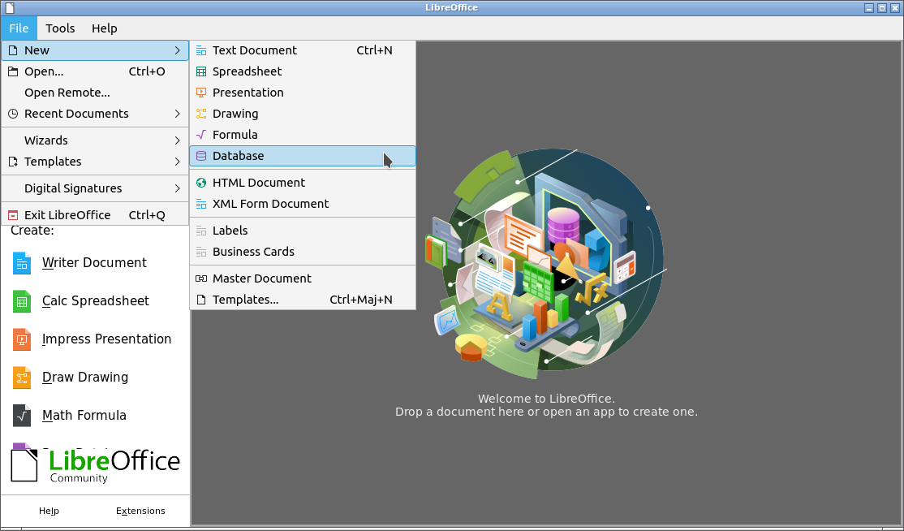
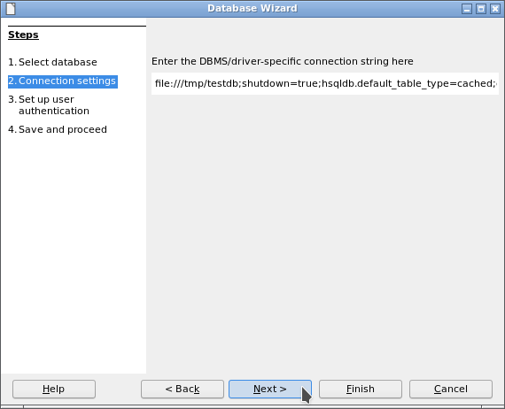

#  jdbcDriverOOo

**This [document](https://prrvchr.github.io/jdbcDriverOOo/) in English.**

**L'utilisation de ce logiciel vous soumet à nos** [**Conditions d'utilisation**](https://prrvchr.github.io/jdbcDriverOOo/jdbcDriverOOo/registration/TermsOfUse_fr)

# version [0.0.4](https://prrvchr.github.io/jdbcDriverOOo/README_fr#historique)

## Introduction:

**jdbcDriverOOo** fait partie d'une [Suite](https://prrvchr.github.io/README_fr) d'extensions [LibreOffice](https://fr.libreoffice.org/download/telecharger-libreoffice/) et/ou [OpenOffice](https://www.openoffice.org/fr/Telecharger/) permettant de vous offrir des services inovants dans ces suites bureautique.  

Cette extension vous permet d'utiliser le pilote JDBC de votre choix directement dans Base.  
Elle embarque les pilotes pour les base de données suivantes:
- [HyperSQL ou HsqlDB](http://hsqldb.org/) version 2.51.
    Les protocoles gérés par HsqlDB pris en charge sont: hsql://, hsqls://, http://, https://, mem://, file:// et res://.
- [H2 Database Engine](https://www.h2database.com/html/main.html) version 2.1.210.
- [Apache Derby](https://db.apache.org/derby/) version 10.15.2.0.

Etant un logiciel libre je vous encourage:
- A dupliquer son [code source](https://github.com/prrvchr/jdbcDriverOOo/).
- A apporter des modifications, des corrections, des améliorations.
- D'ouvrir un [dysfonctionnement](https://github.com/prrvchr/jdbcDriverOOo/issues/new) si nécessaire.

Bref, à participer au developpement de cette extension.  
Car c'est ensemble que nous pouvons rendre le Logiciel Libre plus intelligent.

## Prérequis:

jdbcDriverOOo est un pilote JDBC écrit en Java.  
Son utilisation nécessite [l'installation et la configuration](https://wiki.documentfoundation.org/Documentation/HowTo/Install_the_correct_JRE_-_LibreOffice_on_Windows_10/fr) dans LibreOffice / OpenOffice d'un **JRE version 11 ou ultérieure**.  
Je vous recommande [Adoptium](https://adoptium.net/releases.html?variant=openjdk11) comme source d'installation de Java.

Si vous utilisez le pilote HsqlDB avec **LibreOffice sous Linux**, alors vous êtes sujet au [dysfonctionnement 139538](https://bugs.documentfoundation.org/show_bug.cgi?id=139538).  
Pour contourner le problème, veuillez désinstaller les paquets:
- libreoffice-sdbc-hsqldb
- libhsqldb1.8.0-java

Si vous souhaitez quand même utiliser la fonctionnalité HsqlDB intégré fournie par LibreOffice, alors installez l'extension [HsqlDBembeddedOOo](https://prrvchr.github.io/HsqlDBembeddedOOo/README_fr).  
OpenOffice et LibreOffice sous Windows ne sont pas soumis à ce dysfonctionnement.

## Installation:

Il semble important que le fichier n'ait pas été renommé lors de son téléchargement.  
Si nécessaire, renommez-le avant de l'installer.

- Installer l'extension  **[jdbcDriverOOo.oxt](https://github.com/prrvchr/jdbcDriverOOo/raw/master/jdbcDriverOOo.oxt)** version 0.0.4.

Redémarrez LibreOffice / OpenOffice après l'installation.

## Utilisation:

Ce mode d'utilisation utilise une base de données HsqlDB.

### Comment créer une nouvelle base de données:

Dans LibreOffice / OpenOffice aller à: Fichier -> Nouveau -> Base de données...:

A l'étape: Sélectionner une base de données:
- selectionner: Connecter une base de données existante
- choisir: Pilote HsqlDB
- cliquer sur le bouton: Suivant

A l'étape: Paramètres de connexion:

- pour le protocole: **file://**
    - dans URL de la source de données saisir:
        - pour **Linux**: `file:///tmp/testdb;default_schema=true;shutdown=true;hsqldb.default_table_type=cached;get_column_name=false`
        - pour **Windows**: `file:///c:/tmp/testdb;default_schema=true;shutdown=true;hsqldb.default_table_type=cached;get_column_name=false`

- pour le protocole: **hsql://**
    - Dans un terminal, se placer dans un dossier contenant l'archive hsqldb.jar et lancer:
        - pour **Linux**: `java -cp hsqldb.jar org.hsqldb.server.Server --database.0 file:///tmp/testdb --silent false`
        - pour **Windows**: `java -cp hsqldb.jar org.hsqldb.server.Server --database.0 file:///c:/tmp/testdb --silent false`
    - dans URL de la source de données saisir: `hsql://localhost/;default_schema=true`

- cliquer sur le bouton: Suivant

A l'étape: Paramétrer l'authentification de l'utilisateur:
- cliquer sur le bouton: Tester la connexion

Si la connexion a réussi, vous devriez voir cette fenêtre de dialogue:

Maintenant à vous d'en profiter...

### Comment mettre à jour le pilote JDBC:

Il est possible de mettre à jour le pilote JDBC (hsqldb.jar, h2.jar, derbytools.jar) vers une version plus récente.  
Si vous utilisez HsqlDB comme base de données, procédez comme suit:
1. Faite une copie (sauvegarde) du dossier contenant votre base de données.
2. Lancer LibreOffice / OpenOffice et changez la version du pilote JDBC dans: Outils -> Options -> Pilotes Base -> Pilote JDBC, par une version plus récente.
3. Redémarrer LibreOffice / OpenOffice aprés le changement du pilote (hsqldb.jar, h2.jar, derbytools.jar).
4. Dans Base, aprés avoir ouvert votre base de données, allez à: Outils -> SQL et tapez la commande SQL: `SHUTDOWN COMPACT` ou `SHUTDOWN SCRIPT`.

Maintenant votre base de données est à jour.

## A été testé avec:

* LibreOffice 7.0.4.2 - Ubuntu 20.04 - LxQt 0.14.1

* LibreOffice 6.4.4.2 - Windows 7 SP1

Je vous encourage en cas de problème :-(  
de créer un [dysfonctionnement](https://github.com/prrvchr/jdbcDriverOOo/issues/new)  
J'essaierai de le résoudre ;-)

## Historique:

### Introduction:

Ce pilote a été écrit pour contourner certains problèmes inhérents à l'implémentation UNO du pilote JDBC intégré dans LibreOffice / OpenOffice, à savoir:

- L'impossibilité de fournir le chemin de l'archive Java du driver (hsqldb.jar) lors du chargement du pilote JDBC.
- Ne pas pouvoir utiliser les instructions SQL préparées (PreparedStatement) voir [bug 132195](https://bugs.documentfoundation.org/show_bug.cgi?id=132195).

Afin de profiter des dernières fonctionnalités offertes par les bases de données et entre autre HsqlDB, il était nécessaire d'écrire un nouveau pilote.

Jusqu'à la version 0.0.3, ce nouveau pilote n'est qu'une surcouche ou emballage (wrapper) en Python autour des services UNO fournis par le pilote LibreOffice / OpenOffice JDBC défectueux.  
Depuis la version 0.0.4, il a été complètement réécrit en Java sous Eclipse, car qui mieux que Java peut donner accès à JDBC dans l'API UNO...  
Afin de ne pas empêcher le pilote JDBC natif de fonctionner, il se charge lors de l'appel des protocoles suivants:

- `xdbc:*`
- `xdbc:h2:*`
- `xdbc:derby:*`
- `xdbc:hsqldb:*`

mais utilise le protocole `jdbc:*` en interne pour se connecter.

Il permet également d'offrir des fonctionnalités que le pilote JDBC implémenté dans LibreOffice / OpenOffice ne fournit pas, à savoir:

- La gestion des droits et des utilisateurs dans Base.
- L'utilisation du type SQL Array dans les requêtes.
- Tout ce que nous sommes prêts à mettre en œuvre.

Pour l'instant, seule l'utilisation du type SQL Array dans les requêtes est disponible.

### Ce qui a été fait pour la version 0.0.1:

- La rédaction de ce pilote a été facilitée par une [discussion avec Villeroy](https://forum.openoffice.org/en/forum/viewtopic.php?f=13&t=103912), sur le forum OpenOffice, que je tiens à remercier, car la connaissance ne vaut que si elle est partagée...

- Utilisation de la nouvelle version de HsqlDB 2.5.1.

- Beaucoup d'autres correctifs...

### Ce qui a été fait pour la version 0.0.2:

- Ajout d'une boîte de dialogue permettant de mettre à jour le pilote (hsqldb.jar) dans: Outils -> Options -> Pilotes Base -> Pilote HsqlDB

- Beaucoup d'autres correctifs...

### Ce qui a été fait pour la version 0.0.3:

- Je tiens particulièrement à remercier fredt à [hsqldb.org](http://hsqldb.org/) pour:

    - Son accueil pour ce projet et sa permission d'utiliser le logo HsqlDB dans l'extension.

    - Son implication dans la phase de test qui a permis de produire cette version 0.0.3.

    - La qualité de sa base de données HsqlDB.

- Fonctionne désormais avec OpenOffice sous Windows.

- Un protocole non pris en charge affiche désormais une erreur précise.

- Une url non analysable affiche désormais une erreur précise.

- Gère désormais correctement les espaces dans les noms de fichiers et les chemins.

- Beaucoup d'autres correctifs...

### Ce qui a été fait pour la version 0.0.4:

- Réécriture de [Driver](https://github.com/prrvchr/jdbcDriverOOo/blob/master/java/Driver/source/io/github/prrvchr/uno/sdbc/Driver.java) en Java version 11 OpenJDK amd64 sous Eclipse 4.11.0 avec le plugin: LibreOffice Extension/Component Development - Java version 4.0.1.

- Ecriture des services `Statement`, `PreparedStatement`, `CallableStatement`, `ResultSet`, `...` de JDBC (merci à hanya pour [MRI](https://github.com/hanya/MRI) qui m'a été d'une aide précieuse...)

  - [com.sun.star.sdb.*](https://github.com/prrvchr/jdbcDriverOOo/tree/master/java/Driver/source/io/github/prrvchr/uno/sdb)

  - [com.sun.star.sdbc.*](https://github.com/prrvchr/jdbcDriverOOo/tree/master/java/Driver/source/io/github/prrvchr/uno/sdbc)

  - [com.sun.star.sdbcx.*](https://github.com/prrvchr/jdbcDriverOOo/tree/master/java/Driver/source/io/github/prrvchr/uno/sdbcx)

- Intégration dans jdbcDriverOOo des pilotes JDBC H2 et Derby en plus de HsqlDB. Implémentation de Services Java afin de corriger d'éventuels défauts, ou incompatibilité avec l'API UNO, des pilotes JDBC embarqués. 

- Renommage du dépot et de l'extension **HsqlDBDriverOOo** en **jdbcDriverOOo**.

- Prise en charge dans Base des clés primaires auto incrémentées pour HsqlDB et Derby. H2 ne supporte pas encore.

- Ecriture de [com.sun.star.sdbcx.Driver](https://github.com/prrvchr/jdbcDriverOOo/blob/master/java/Driver/source/io/github/prrvchr/uno/sdbcx/Driver.java). Ce pilote de haut niveau doit permettre la gestion des utilisateurs et des droits dans Base. Son utilisation peut être demandée dans: **Outils -> Options -> Pilotes Base -> Pilote JDBC**. Il n'est pas terminé et n'est pas encore fonctionnel.

- Réécriture, en suivant le modèle MVC, de la fenêtre des [Options](https://github.com/prrvchr/jdbcDriverOOo/tree/master/jdbcDriverOOo/pythonpath/jdbcdriver/options), accessible par: **Outils -> Options -> Pilotes Base -> Pilote JDBC**, afin de permettre l'ajout d'eventuelles archives Java de pilotes JDBC.

- Beaucoup d'autres correctifs...

### Que reste-t-il à faire pour la version 0.0.4:

- La gestion des droits et des utilisateurs dans Base en lecture et écriture...

- Ajouter de nouvelles langues pour l'internationalisation...

- Tout ce qui est bienvenu...
